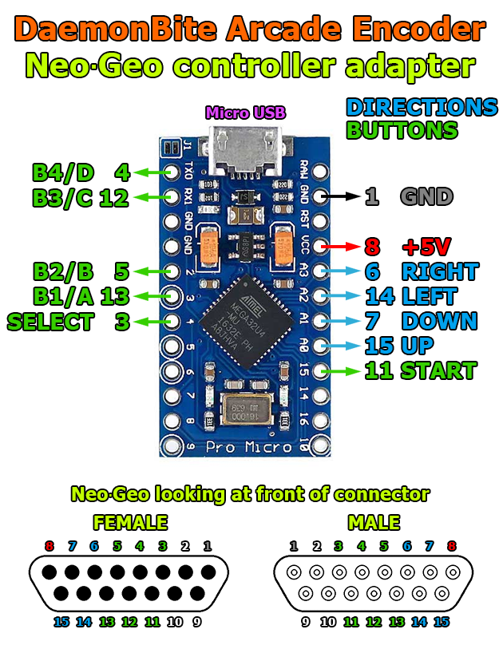

# DaemonBite NeoGeo Controllers To USB Adapter
## Introduction
This is a simple to build adapter for connecting two NeoGeo controllers to USB.

## Parts you need
- Arduino Pro Micro (ATMega32U4)
- 2x DB15 Male Connectors and some wire
- Heat shrink tube (Ø ~20mm)
- Micro USB cable

## Wiring

## License
This project is licensed under the GNU General Public License v3.0.

## Credits
The Mega Drive gamepad interface is based on this repository : https://github.com/jonthysell/SegaController but almost entirely rewritten and a lot of optimisations have been made.
